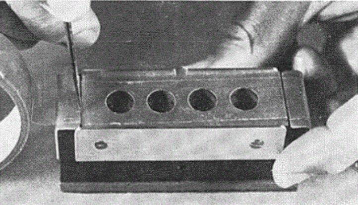
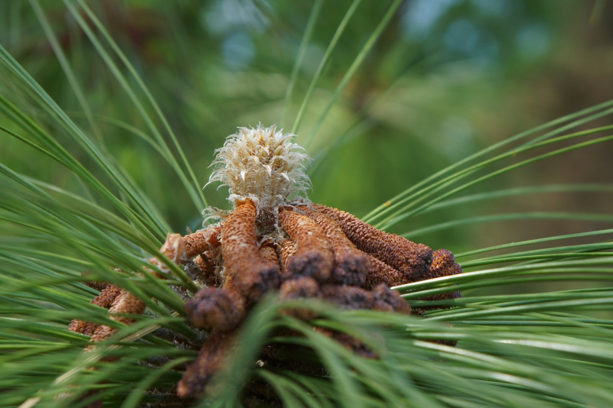

# Longleaf pine pollen countdown for the Southeast

Jeffery Cannon, Ph.D., <em>Landscape Ecologist</em>

Every spring, longleaf pines release their pollen almost on schedule, and the schedule is set by temperature. Here is where the peak pollen season from longleaf pine is expected to occur.

<!-- MAP -->

How do we know?

<i>Method</i><b>1973</b>Boyer discovered the formula for peak pollen, worked out with Scotch tape and a microscope.

<i>Data</i><b>270+</b>airport weather stations feed the map, and it is refreshed every morning during the season.

<i>Accuracy</i><b>9 in 10</b>forecasts made in the last ten days land within three days of the day Boyer’s heat threshold is reached.

## Pine pollen shedding

**Each spring I battle with allergies.** It starts with itchy, watery eyes, progresses into a runny nose, and culminates in wall-shaking sneezes. I realize we are in the midst of allergy season when I find that my metallic blue SUV has been dusted with a powdery-yellow film of pine pollen. Pine pollen is a weak allergen for most people (the grains are large and low in protein), so I can’t blame it for my sneezing, although a few people do react to it[1](#ref-1). But I can blame the pines for sullying my car—usually only a day or two after giving it a wash.

Watching pine trees shed their pollen is fascinating. Once a tree canopy is filled with ripened catkins (the pollen-producing structures), even a slight breeze can trigger the pollen to release. As the branches gently jostle, a yellow cloud billows forth, rolling slowly from the needles before the yellow haze disappears into the wind. Whole stands of pine may erupt their pollen during the same gust of wind.

Without clocks and calendars, many plants rely on environmental cues for reproductive events. Successful reproduction is more likely when pollen release happens while female cones are most receptive. So, it should not be surprising that pollen release is so well-timed to weather events.

Although allergy season surprises me each year, the timing of pollen shedding in pines is remarkably predictable. In 1973, USDA Forest Service scientist, Bill Boyer, discovered a way to successfully predict peak pine pollen shedding within just a day or two using only air temperature records and some Scotch® tape.

Boyer worked for the USDA Forest Service – [Southern Research Station](https://www.fs.usda.gov/research/srs) in rural Brewton, Alabama. For decades, he conducted painstaking work to study the reproductive patterns of longleaf pine. He was interested in the longleaf pine ecosystem because it once stretched over 90 million acres in the southeastern U.S., but due to unsustainable logging and land use changes throughout the 19th and 20th centuries, the ecosystem was reduced to [only 5% of its historic range](https://books.google.com/books?id=-MN5MO16ECYC)[2](#ref-2). Boyer wanted to learn more about reproduction in longleaf pine to help conservationists understand how to reestablish and manage the species, and eventually help it recover.

## Boyer’s pollen experiment

For 10 consecutive years (1957 – 1966), Boyer set out tiny pollen traps that allowed him to carefully track pollen shedding in the pines surrounding his office building in the months before and after peak pollen season[3](#ref-3). [The traps](https://academic.oup.com/forestscience/article-abstract/4/1/94/4564858) were nothing more than a glass microscope slide wrapped with bit of Scotch® tape—sticky side out[4](#ref-4). The traps were laid out to capture a sample of the day’s airborne pollen. Boyer replaced them every 2-3 days. Using a microscope, he meticulously counted the density of pollen grains on each slide allowing him to track how much pollen was shed on different days each spring.

*Figure 1. Polyester tape applied to a microscope slide similar to the one Boyer adopted for studying longleaf pine pollen grains. [Grano (1958) Forest Science 4(1) 94-95](https://academic.oup.com/forestscience/article-abstract/4/1/94/4564858)*

Boyer knew that many biological processes depend on environmental conditions, so it was logical to study the role of temperature in pollen shedding. Pines have small, flower-like structures known as catkins that are responsible for producing pollen. Boyer hypothesized that catkins grow and develop rapidly on warm days, but their development could be stifled by cool temperatures. When examining his ten years of pollen and temperature records, he made an important discovery.

*Figure 2. Maturing pine catkins of a longleaf pine. Photo Credit: [John Winder](https://www.flickr.com/photos/83833206@N00/42094013401/), [CC BY-NC-ND 2.0](https://creativecommons.org/licenses/by-nc-nd/2.0/), Flickr*

Boyer found that for longleaf pine, catkin development advanced only when temperatures climbed above 50 °F. For each hour that temperatures were above 50 °F, the development of the catkins would slowly advance, ratcheting them closer and closer to maturity.

Boyer used a measure called a *heat sum* to predict the exact day the catkins would mature and release pollen. For every hour the air temperature stayed above 50 °F, Boyer would add up the number of *degree-hours* over 50 °F. For example, if temperatures were 60 °F for 1 hour (50 °F + 10 °F), then the total heat sum would increase by 10 degree-hours. If the temperature averaged 70 °F over the next hour (50 °F + 20 °F), the heat sum would increase by another 20 degree-hours. (Boyer worked from hourly temperature readings; the map estimates the same thing from each day’s high and low, as described in [the methodology page](methods.html#from-temperatures-to-heat).) In the chart for any station (hover over or click a dot on the map above), the red line tracks the slow accumulation of the heat sum for this year. As the year progresses, the actual heat sum requirement steadily decreases (blue line). By the time the accumulated heat sum exceeds the required threshold, longleaf pine catkins have reached maturity and the pollen is ready to shed.

*Figure 3. Data from Boyer’s [original 1973 article](https://doi.org/10.2307/1934351) shows a close match between when the day of the year he expected peak pollen shed, and the actual day of the year it occurred. [Boyer (1973) Ecology 54 (2) 420-426.](https://doi.org/10.2307/1934351)*

## Boyer’s legacy

**Boyer’s research laid the foundation for much of the modern-day research on longleaf pine reproduction.** In addition to meticulous pollen counts, Boyer initiated a [long-term survey of pine cone](https://research.fs.usda.gov/treesearch/972) production across the Southeast in 1958[5](#ref-5). Using only binoculars, he selected a group of trees in several areas throughout the region, and counted each cone produced to learn more about the drivers of reproductive success. These cone surveys are continued by his successors at the Southern Research Station, and they continue to lead to discoveries in pine reproduction to this day[6](#ref-6)–[8](#ref-8).

Today, what started as Boyer’s curiosity has become an invaluable record, now more than six decades long, of longleaf pine cone production across the southeastern U.S. In 2024, our research team used these data to answer a perplexing question about longleaf pine cones. Cone production in some pines is extremely variable. This is a challenge because to naturally regenerate the species, forest managers need to anticipate favorable cone production to effectively schedule prescribed burns that help improve germination. Using the cone surveys initiated by Boyer, we discovered that hurricanes were a big driver of cone production. By combining cone counts by Boyer, weather data, and hurricane tracks, we found that precipitation from hurricanes can [boost pine cone production](https://nph.onlinelibrary.wiley.com/doi/10.1111/nph.19381) for about 2 years[8](#ref-8). Hurricanes are so infrequent that such a pattern is difficult to detect without long-term data. The findings suggest that even though it may be difficult to spot, hurricanes play a pivotal role in the biology and ecology of some coastal tree species.

Boyer’s foresight and long-term view of research went beyond pine reproduction and pollen shedding. His work has fostered many insights into the biology of longleaf pine. His steadfast and diligent efforts continue to advance knowledge of pollen production and the conservation and management of an iconic species of the southeastern U.S. And that contribution is nothing to sneeze at.

Behind the map

## Methodology

**How the forecast is made, and how well it works, has its own page.** In the last ten days before the peak, about nine in ten forecasts land within three days of the true date; a month or more ahead, the typical miss is about four days. The [methodology page](methods.html) covers the data, the math, the map, and the replays of past springs behind those numbers.

## References

1. Gastaminza, G., Lombardero, M., Bernaola, G., Antepara, I., Muñoz, D., Gamboa, P. M., Audicana, M. T., Marcos, C., & Ansotegui, I. J. (2009). Allergenicity and cross-reactivity of pine pollen. *Clinical & Experimental Allergy*, 39(9), 1438–1446. [https://doi.org/10.1111/j.1365-2222.2009.03308.x](https://doi.org/10.1111/j.1365-2222.2009.03308.x)
2. Noss, R. F., LaRoe III, E. T., & Scott, J. M. (1995). Endangered ecosystems of the United States: A preliminary assessment of loss and degradation. *Biological Report - US Department of the Interior, National Biological Service*, 28. [Google Books](https://books.google.com/books?id=-MN5MO16ECYC)
3. Boyer, W. D. (1973). Air temperature, heat sums, and pollen shedding phenology of longleaf pine. *Ecology*, 54(2), 420–426. [https://doi.org/10.2307/1934351](https://doi.org/10.2307/1934351)
4. Grano, C. X. (1958). Equipment Notes: A Timesaving Slide for Trapping Atmospheric Pollen. *Forest Science*, 4(1), 94–95. [https://doi.org/10.1093/forestscience/4.1.94](https://doi.org/10.1093/forestscience/4.1.94)
5. Boyer, W. D. (1987). Annual and geographic variations in cone production by longleaf pine. In *Proceedings of the Fourth Biennial Southern Silvicultural Research Conference: Atlanta, Georgia, November 4-6, 1986* (General Technical Report SE-42, pp. 73–76). Southeastern Forest Experiment Station. [https://research.fs.usda.gov/treesearch/972](https://research.fs.usda.gov/treesearch/972)
6. Guo, Q., Zarnoch, S. J., Chen, X., & Brockway, D. G. (2016). Life cycle and masting of a recovering keystone indicator species under climate fluctuation. *Ecosystem Health and Sustainability*, 2(6), e01226. [https://doi.org/10.1002/ehs2.1226](https://doi.org/10.1002/ehs2.1226)
7. Chen, X., & Willis, J. L. (2023). Individuals’ Behaviors of Cone Production in Longleaf Pine Trees. *Forests*, 14(3), 494. [https://doi.org/10.3390/f14030494](https://doi.org/10.3390/f14030494)
8. Cannon, J. B., Rutledge, B. T., Puhlick, J. J., Willis, J. L., & Brockway, D. G. (2024). Tropical cyclone winds and precipitation stimulate cone production in the masting species longleaf pine (*Pinus palustris*). *New Phytologist*, 242(1), 289–301. [https://doi.org/10.1111/nph.19381](https://doi.org/10.1111/nph.19381)
